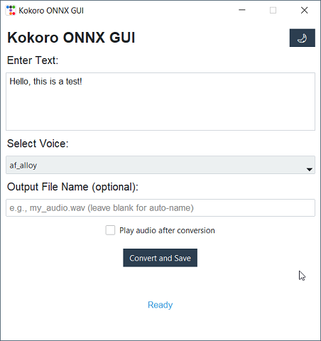

# kokoro-onnx-windows

### This attempts to add an easy way to install on windows and also features an optional gui. 

TTS with onnx runtime based on [Kokoro-TTS](https://huggingface.co/spaces/hexgrad/Kokoro-TTS)

🚀 Version 1.0 models are out now! 🎉

https://github.com/user-attachments/assets/00ca06e8-bbbd-4e08-bfb7-23c0acb10ef9

## Features

- Supports multiple languages 
- Fast performance near real-time on macOS M1
- Offer multiple voices
- Lightweight: ~300MB (quantized: ~80MB)

## Install automatically using 1-click installer batch file
1) Download and install [Python 3.8 or higher](https://www.python.org/downloads/release/python-3106/)  
   - Check the 'Add Python 3.* to PATH' box [during installation](audio2vmd/img/pathbox.jpg)
2) Download [kokoro-onnx-windows](https://github.com/EliseWindbloom/kokoro-onnx-windows/archive/refs/heads/main.zip)
3) Unzip kokoro-onnx-windows and run "install.bat" (Do not run as admin) to install automatically, this may take awhile to download all the required files.

## Usage
- Run **run_example.bat** to see an example audio file generated from text
- Run **kokoro_gui.bat** to launch gui where you can easily set input text/voice/save name and convert the the text-to-audio file

<details>
<summary>Orignal setup instructions</summary>
## Setup

```console
pip install -U kokoro-onnx
```

Instructions

1. Install [uv](https://docs.astral.sh/uv/getting-started/installation) for isolated Python (Recommend).

Basically open the terminal (PowerShell / Bash) and run the command listed in their website.

_Note: you don't have to use `uv`. but it just make things much simpler. You can use regular Python as well._

2. Create new project folder (you name it)
3. Run in the project folder

```console
uv init -p 3.12
uv add kokoro-onnx soundfile
```

4. Paste the contents of [`examples/save.py`](https://github.com/thewh1teagle/kokoro-onnx/blob/main/examples/save.py) in `hello.py`
5. Download the files [`kokoro-v1.0.onnx`](https://github.com/thewh1teagle/kokoro-onnx/releases/download/model-files-v1.0/kokoro-v1.0.onnx), and [`voices-v1.0.bin`](https://github.com/thewh1teagle/kokoro-onnx/releases/download/model-files-v1.0/voices-v1.0.bin) and place them in the same directory.
6. Run

```console
uv run hello.py
```

You can edit the text in `hello.py`

That's it! `audio.wav` should be created.

</details>

## Examples

See [examples](examples)

## Voices

See the latest voices and languages in [Kokoro-82M/VOICES.md](https://huggingface.co/hexgrad/Kokoro-82M/blob/main/VOICES.md)

Note: It's recommend to use misaki g2p package from v1.0, see [examples](examples)

## GUI Preview


## Contribute

See [CONTRIBUTE.md](CONTRIBUTE.md)

## License

- kokoro-onnx: MIT
- kokoro model: Apache 2.0
